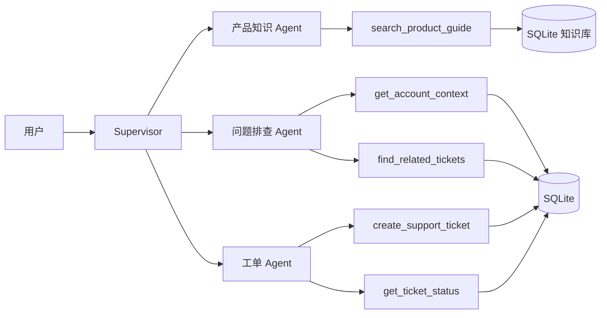

# TicketFlow Agents｜多智能体客服工单系统

TicketFlow Agents 是一个面向 SaaS 产品支持场景的 LangGraph 多智能体工作台。Supervisor 根据用户意图，把请求交给产品知识、问题排查或工单处理 Agent。页面提供智能协作、工单工作台和知识库三个入口，方便查看智能体实际产生的业务结果。GitHub 仓库名暂时保留为 SupportPilot。

## 能做什么

- 产品知识 Agent 检索可在页面维护的知识条目，回答产品使用和设置问题。
- 问题排查 Agent 查询演示账号上下文与相似历史工单，给出有依据的排查线索。
- 工单处理 Agent 校验账号与描述后创建工单，或按编号查询状态。
- 工单工作台支持查看、筛选、人工创建工单，更新状态并记录处理过程。
- 知识库支持新增、更新、停用知识；下一轮对话立即使用启用的内容。
- 智能协作页按提问保留当前页面的执行历史，分别显示实际参与的智能体和工具调用；新建对话会清空这份记录。
- 对话建单先等待用户确认；账号在本地校验，Agent 建单工具入口也会拒绝未经确认的调用。Supervisor 漏掉建单步骤时，工单 Agent 会补全一次。

试用问题：

- 如何邀请同事加入工作区？
- 帮我排查 acme-001 的报表导出失败，看看有没有相似历史工单
- 帮我为 acme-001 创建一个高优先级工单：点击导出报告后提示失败，无法下载 CSV 文件
- SP-1001 现在是什么状态？

## 推荐体验顺序

1. 在“智能协作”问产品使用问题，观察路由到产品知识 Agent。
2. 描述故障并要求查询相似案例，观察路由到问题排查 Agent。
3. 要求为 `acme-001` 创建工单，回复“确认创建”；然后到“工单工作台”刷新列表，查看新工单与创建记录。
4. 在工单工作台填写处理记录，将状态改为 `in_progress` 或 `resolved`；回到智能协作按工单号查询。
5. 在“知识库”新增一条有关键词的指南，再问对应问题，观察知识 Agent 使用新内容。

右侧“执行历史”按提问分段：每段只记录该轮实际接手的智能体和业务工具调用。切换智能体后，前几轮的名称不会改变。建单请求在确认前只会显示等待确认，回复“确认创建”后才会出现建单调用。点击“新建对话”或刷新页面会清空这份页面记录；工单、处理记录和知识条目仍保存在 SQLite。

想按代码逐步理解项目，可看 [学习指南与面试准备](docs/learning-guide.md)。

## 架构



每个 Agent 只拿到完成职责所需的工具。产品知识 Agent 不创建工单；问题排查 Agent 只读历史数据；工单 Agent 不编造产品说明。Supervisor 负责分流和汇总。Agent 使用的建单工具还要检查页面设置的确认状态，防止错误路由直接写库；页面会核对工具返回的工单号，必要时补一次工单 Agent 调用。对话状态由 LangGraph 的 MemorySaver 按 thread_id 保存，仅在当前进程内有效。Supervisor 的事件包含完整消息历史，页面只提取当前请求新增的消息，再按轮保存执行记录，避免把旧工具调用误记到新智能体名下。

## 技术栈

Python、LangChain、LangGraph、LangGraph Supervisor、Gradio、SQLAlchemy、SQLite、阿里云百炼 OpenAI 兼容模型 API。

## 本地启动

需要 Python 3.10+ 和一个 OpenAI 兼容模型 API Key。

```powershell
python -m venv .venv
.\.venv\Scripts\Activate.ps1
pip install -r requirements.txt
Copy-Item .env.example .env
```

编辑 `.env`，填入阿里云百炼 API Key：

```env
DASHSCOPE_API_KEY=你的阿里云百炼 API Key
OPENAI_API_BASE=https://dashscope.aliyuncs.com/compatible-mode/v1
MODEL_NAME=qwen-plus
```

启动：

```powershell
python app.py
```

浏览器访问 http://localhost:7860。应用默认只监听本机。首次运行会在项目根目录创建 `supportpilot.db`，内置两个演示账号和两条工单。账号 ID 为 `acme-001` 和 `northstar-002`。

## 代码入口

| 文件 | 作用 |
|---|---|
| `src/agents/graph.py` | 创建三个 ReAct 专职 Agent，并交给 Supervisor 编排 |
| `src/agents/prompts.py` | 定义 Supervisor 和专职 Agent 的职责边界 |
| `src/agents/intent.py` | 页面建单确认时使用的简单意图判断 |
| `src/tools/product_knowledge.py` | SQLite 产品指南关键词检索工具 |
| `src/tools/triage.py` | 账号上下文与相似工单工具 |
| `src/tools/ticketing.py` | 创建工单、查询工单状态工具 |
| `src/db/database.py` | 初始化演示账号、工单、处理记录和知识表 |
| `src/db/support_data.py` | 工作台读写与筛选逻辑 |
| `src/ui/app.py` | Gradio 智能协作、工单和知识库页面 |
| `eval/routing_eval.py` | 用隔离的临时数据库检查 6 条 Supervisor 路由用例 |

## 当前 Demo 的边界

- 产品指南是 SQLite 小型语料上的关键词检索，不是向量 RAG；向量混合检索在 HybridRAG 项目展示。
- 演示账号 ID 只用于路由和数据示例，不构成真实身份认证。
- 工单与知识保存在本地 SQLite；对话 checkpoint 只在服务进程内存中，页面执行历史只在当前浏览器会话中。此项目不面向生产部署。
- 工单优先级由模型根据用户表达提取，工具仍会校验合法取值。
- 工单工作台只适合本机演示，没有客服人员登录、权限控制或外部通知。
- 建单确认不是身份认证。Agent 的建单工具默认拒绝未经确认的请求；工作台人工建单要求勾选确认。直接调用底层的数据库写入工具不经过页面确认。
- 最新一次 6 条路由样例通过 4 条；多次运行中也曾出现纯排查请求被错误转给工单 Agent。工具入口的确认校验会阻止这类错误写库。模型路由仍有波动，不能据此声称路由始终正确。

## 本地检查

运行 `python -m pytest -q` 检查消息格式、建单确认、执行历史和数据库工具。检查使用独立的内存 SQLite，不会修改页面使用的 `supportpilot.db`，也不需要调用模型 API。

## 路由检查

配置 `.env` 后运行 `python -m eval.routing_eval`。脚本使用临时 SQLite 数据库，不会修改页面的 `supportpilot.db`；逐题结果写入 `eval/routing_results.json`。它检查原始 Supervisor 路由和业务工具调用，页面的确认与补全流程另行验证。评测涉及真实模型调用，重复运行可能得到不同结果。

## 来源与许可

本仓库是在 [ANI-IN/Multi-Agent-Customer-Support](https://github.com/ANI-IN/Multi-Agent-Customer-Support) 的 MIT 许可代码基础上学习和改造的版本。保留原项目的 [LICENSE](LICENSE) 和版权声明；本版本新增了 SaaS 支持业务场景、三个专职 Agent 的工具与提示词、SQLite 知识和工单工作台。LangGraph、LangChain、Gradio 等依赖分别遵循其各自许可。
