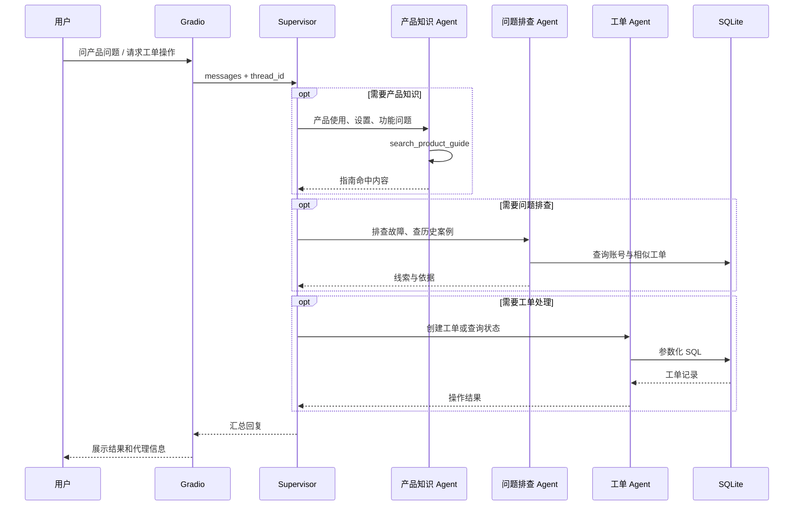

# TicketFlow Agents 多智能体架构

## 一轮请求如何运行

1. Gradio 收到建单请求时先等待“确认创建”，并在确认后检查账号 ID；其他请求直接进入下一步。
2. Gradio 将用户消息包装为 HumanMessage，并传入当前 thread_id。
3. Supervisor 判断请求是产品使用、问题排查、工单操作，还是需要跨智能体协作。
4. 专职 Agent 调用自己的工具。产品 Agent 搜 SQLite 知识；排障 Agent 读账号和相似工单；工单 Agent 查询或写入 SQLite。
5. Agent 的建单工具入口先检查页面设置的确认状态；页面再核对是否实际返回工单号。确认过的建单请求若漏了工单 Agent，会补全一次。
6. MemorySaver 保存当前对话线程状态，方便多轮交流。

## Agent 职责边界

| Agent | 工具 | 可处理请求 |
|---|---|---|
| product_knowledge_agent | search_product_guide | 产品操作说明、设置入口、使用方法 |
| triage_agent | get_account_context、find_related_tickets | 读取账号上下文、查找相似历史问题 |
| ticket_ops_agent | create_support_ticket、get_ticket_status | 创建工单、查询工单 |
| Supervisor | 无业务工具 | 意图分流、组合结果、处理超出指南范围的情况 |

## 关键工程点

- **显式工具边界**：每个 Agent 只接收职责内的工具，降低错误调用的机会。
- **参数化 SQL**：账号 ID、工单号、描述和优先级都通过绑定参数写入/查询。
- **数据校验**：工单优先级限定为 low/normal/high；描述太短时拒绝创建；账号不存在时不写入。
- **按会话 checkpoint**：不同 thread_id 使用独立对话状态；MemorySaver 是进程内存储，重启后会清空。
- **可追踪路由**：UI 从 LangGraph updates 中收集执行过的 specialist 节点。
- **工具可见**：Supervisor 保留专职 Agent 的完整消息历史，UI 才能显示实际调用过的业务工具。
- **建单确认与核对**：Agent 建单工具默认拒绝未确认请求，即使 Supervisor 误路由也不会写库；最终回复以工具返回的工单号为准。
- **工单闭环**：创建、列表筛选、人工处理记录与状态变更都保存在 SQLite。
- **知识维护**：新增、更新和停用知识后，Agent 下一轮检索会读取新的有效内容。

## 简化边界

产品指南检索使用 SQLite 小语料的关键词重合度排序，相似工单使用简单的中英文词项匹配。它们没有使用 embedding、向量库或 reranker；RAG 混合检索在另一个项目中单独展示。工作台仅供本机演示，没有客服登录与权限管理。

按页面和代码逐步学习时，可接着看 [学习指南与面试准备](learning-guide.md)。
